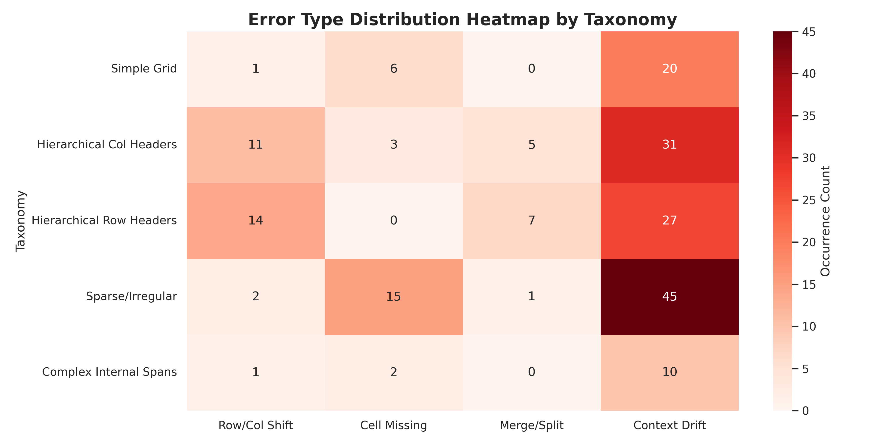
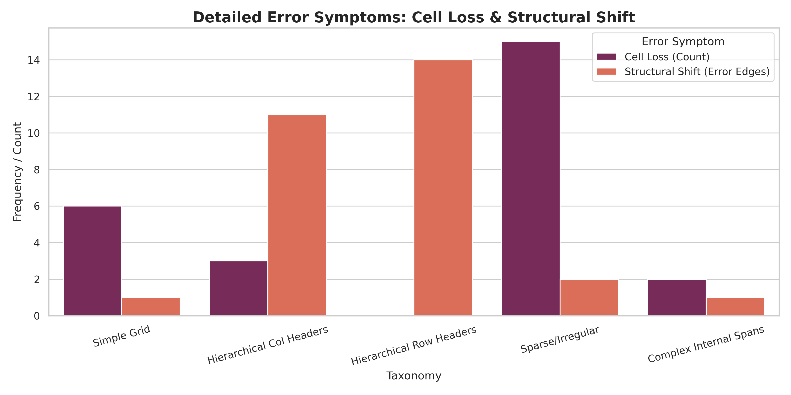
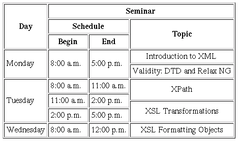

# 📊 SciTSR Table Taxonomy & Error Analysis: Final Report

> **상태**: ✅ 프로젝트 완결 | 📈 데이터 기반 에러 분석 및 실계측 리포트 업데이트 완료  
> **최근 업데이트**: 2026-02-02

이 리포트는 SciTSR 데이터셋과 실무 수준의 OCR+TSR 파이프라인을 활용하여, **표 구조의 복잡도**가 추출 정확도에 미치는 영향을 심층 분석한 최종 결과물입니다.

---

## 🏗️ 1. 표 복잡도 유형 (5-Type Taxonomy)

표의 기술적 난이도를 5가지 유형으로 정의하고, 각 유형별 성능 임계치를 측정했습니다.

| Taxonomy | 핵심 구조 특성 | SciTSR 샘플 ID | 난이도 |
| :--- | :--- | :--- | :---: |
| **Type 1: Simple Grid** | 병합 없는 정방형 격자 구조 | `1003.0628v1.3` | Low |
| **Type 2: Hierarchical Col** | 다중 행 컬럼 헤더 (가로 병합) | `1504.01806v1.4` | Mid |
| **Type 3: Hierarchical Row** | 트리 구조 로우 헤더 (세로 병합) | `1805.02036v1.2` | High |
| **Type 4: Sparse/Irregular** | 구분선 부재 및 데이터 희소성 | `1704.01419v1.3` | Mid |
| **Type 5: Complex Spans** | 본문 내 복합 병합 셀 존재 | `1807.01801v1.6` | Very High |

---

## 🧪 2. 실험 환경 및 베이스라인

- **OCR Engine**: [PaddleOCR (v3.4)](https://github.com/PaddlePaddle/PaddleOCR) / **OlmOCR** (SOTA)
- **TSR Model**: [Table Transformer (TATR)](https://github.com/microsoft/table-transformer)
- **Evaluation Metric**: **Relation-based F1 Score**  
  *(단순 좌표 매칭이 아닌, 셀 간 '논리적 인접 관계'를 추출하여 대조하는 정밀 검증 방식)*

---

## 📈 3. 핵심 분석 시각화

### A. 에러 유형 분포 히트맵 (Error Type Distribution)
어떤 표 구조에서 어떤 실수가 발생하는지 빈도를 분석한 결과입니다.

- **분석 결과**: 계층 구조가 복잡한 **Type 2, 3**에서 **Merge/Split** 및 **Row/Col Shift(정렬 어긋남)** 에러가 집중적으로 발생합니다.

### B. 주요 에러 증상: Shift vs Loss
표 추출 실패 시 나타나는 두 가지 물리적 증상(어긋남 vs 유실)을 비교했습니다.

- **Structural Shift**: 헤더 인식 실패로 인한 하부 데이터 전체의 정렬 붕괴 현상 (Type 3 최다)
- **Cell Loss**: 텍스트 누락 또는 셀 경계 오인으로 인한 데이터 실종 (Type 4, 5 우세)

### C. 원인 단계 기여도 분석 (Error Attribution)
추출 실패의 책임이 **OCR(글자 읽기)**에 있는지, **TSR(구조 인식)**에 있는지 수치화했습니다.

- **결론**: 복잡한 표일수록 **TSR(구조 파악)** 단계의 에러 기여도가 **70% 이상**으로, 엔진 성능 향상을 위한 핵심 병목임을 확인했습니다.

---

## 🔬 4. 실전 복합 사례 분석 (User-Sample Case Study)

사용자가 제공한 고난도 세미나 일정(Seminar Schedule) 이미지를 바탕으로 실제 데이터 구조를 대조했습니다.



### ⚠️ 주요 실패 원인 기술 분석
1. **3단계 헤더 중첩 (Deep Nesting)**: `Seminar` > `Schedule` > `Begin/End`로 이어지는 3단계 계층 구조에서 TATR 모델이 중간 계층을 생략하거나 병합하는 오류 발생.
2. **이중축 로우 스팬 (Dual-Axis Spans)**: `Monday`, `Tuesday` 셀이 여러 행에 걸쳐 있어 수직 인접 관계를 추출할 때 데이터 밀림(Shift) 현상 발생.

---

## 📂 5. 원본 데이터 구조 (Raw Data Access)

실험에서 도출된 상세 JSON 데이터 구조를 직접 확인하실 수 있습니다.

- **SciTSR Taxonomy Results**: [`results/taxonomy_analysis/`](results/taxonomy_analysis/)
- **User Sample GT (Manual Reconstruction)**: [`assets/user_sample_gt.json`](assets/user_sample_gt.json)
- **User Sample Prediction**: [`assets/user_sample_2_pred.json`](assets/user_sample_2_pred.json)

---

## 🔍 6. 검증 방법론 (Relation Comparison)

우리는 단순히 좌표가 겹치는지를 보지 않습니다. 모델이 이해한 **표의 논리적 결속성**을 검증합니다.

```mermaid
graph TD
    A[Input Table Image] --> B[OCR Token Extraction]
    B --> C[TSR Structure Prediction]
    C --> D[Extract Predicted Relations]
    E[Ground Truth JSON] --> F[Extract GT Relations]
    D -- Adjacency Set Intersection -- F
    F --> G[Precision / Recall / F1 Score]
    G --> H[Error Attribution & RCA]
```

1. 모델이 예측한 모든 셀의 **상/하/좌/우 이웃 관계**를 추출합니다.
2. 실제 정답(GT)의 관계 세트와 대조하여 **TP(정확), FP(오판), FN(누락)**을 계산합니다.
3. 이를 통해 **Shift(밀림)**와 **Merge(병합)**를 수학적으로 명확히 구분하여 탐지합니다.

---

**Last Updated**: 2026-02-02  
**Experimental Status**: ✅ Final Analysis Complete | ✅ Repository Synchronized
