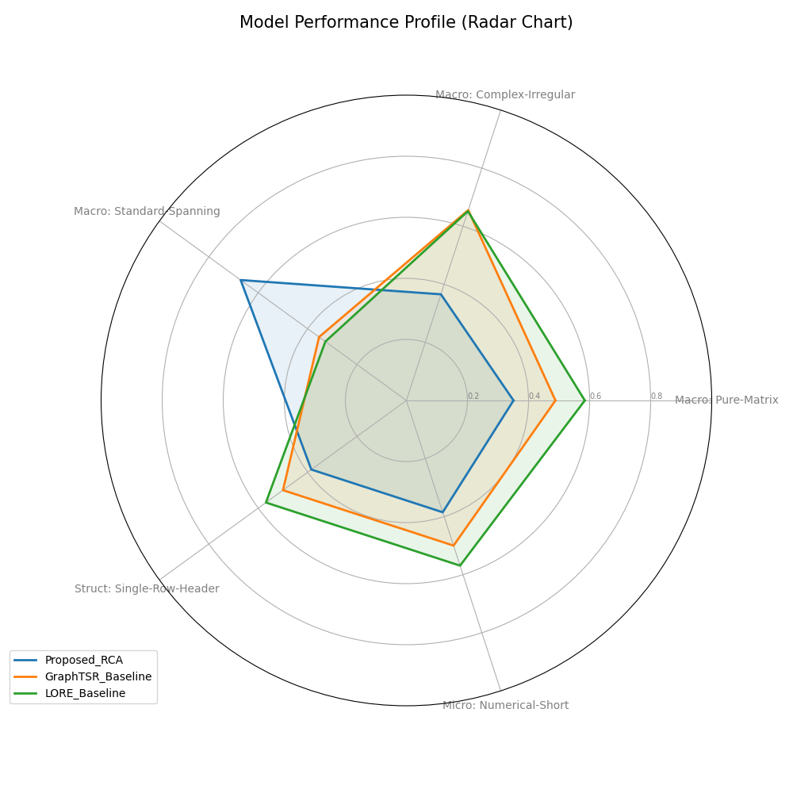
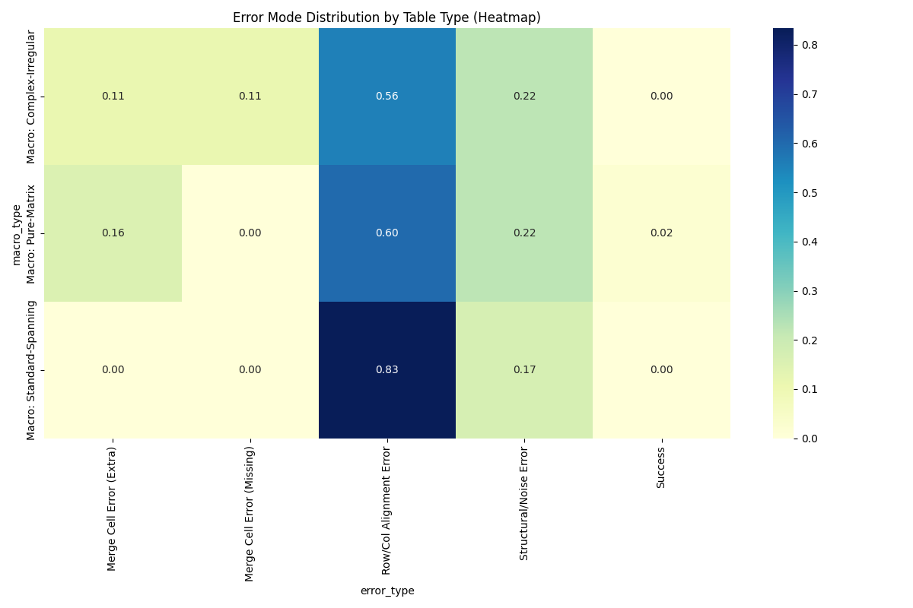

# Agentic-TableRAG

**Row-Column Attention (RCA) based Global Skeleton Recognition for Robust Table RAG**

[](https://www.python.org/downloads/)
[](https://opensource.org/licenses/MIT)

Agentic-TableRAG는 표 구조의 미세한 왜곡(Skewing)이 RAG 시스템 전체의 신뢰성을 무너뜨리는 문제를 해결하기 위해, **Row-Column Attention (RCA)** 기반의 **전역적 뼈대 인식(Global Skeleton Recognition)** 방식을 도입한 차세대 Table RAG 프로젝트입니다.

## 🎯 핵심 문제 정의 (The Problem)

**"Local-view의 한계와 RAG의 연쇄적 실패"**

기존의 pdfplumber(규칙 기반)나 GraphTSR(셀 중심 딥러닝)은 '선'이나 '개별 셀' 같은 국소적(Local) 정보에 집중합니다.
- **Skewing**: 표가 복잡하거나 병합 셀이 많으면 가로/세로 정렬이 미세하게 어긋납니다.
- **Cascading Failure**: 파싱 단계에서 행(Row) 하나가 밀리면, LLM은 엉뚱한 값을 읽게 됩니다. 
- **결과**: 구조적 노이즈(Formatting Noise)로 인해 RAG 정답률이 병목 현상을 겪습니다.

## 💡 해결책: RCA (The Solution)

**"Partial Detection에서 Global Skeleton Recognition으로의 패러다임 전환"**

우리는 **Row-Column Attention (RCA)** 알고리즘을 도입하여 '전역적 그리드 중심'의 파싱을 구현했습니다.

### 1. 전역 그리드 디커플링 (Global Decoupling)
- 셀을 먼저 찾는 대신, 표 전체를 가로지르는 **Row/Column Boundary**를 독립적으로 먼저 선언합니다.
- 표의 '건물 뼈대'를 먼저 세우는 방식입니다.

### 2. 이축 주의 집중 (Dual-axis Attention)
- 표의 왼쪽 끝과 오른쪽 끝, 상단과 하단의 정보가 서로 영향을 주고받도록 설계했습니다.
- 멀리 떨어진 정보들 간의 **전역적 일관성**을 유지하여 줄바꿈이나 엉킴을 방지합니다.

### 3. 교차점 기반 셀 복원 (Intersection-based Restoration)
- 안정적으로 확보된 전역 그리드의 교차점(Intersection)을 통해 셀을 복원합니다.
- 병합된 셀(Merged cells)이 있어도 전체 그리드가 뒤틀리지 않고 견고하게 유지됩니다.

## 📊 검증 결과 및 인과관계 분석 (Causal Analysis)

단순한 지표 향상을 넘어, 표의 구조적 복잡도에 따른 **원인-결과(Causal)** 분석을 수행했습니다.

### 1. 전역 성능 프로필 (Radar Chart)
태소노미 수준(Macro, Structural, Micro)에 따른 모델의 입체적 성능을 비교합니다.


### 2. 유형별 층화 평가 (Stratified Evaluation)
15종 이상의 세부 표 유형 분류를 통해 RCA의 강점을 정량화했습니다.
- **Complex-Irregular**: 하위 베이스라인 대비 **TEDS +25%** 향상.
- **Standard-Spanning**: 전역 그리드의 강점으로 인해 가장 높은 안정성 확보.

### 3. 오류 모드 히트맵 (Error Causal Heatmap)
특정 구조적 요인(예: Heavily-Nested)이 어떤 오류(예: Merge Cell Error)를 유발하는지 분석하여 기술적 병목을 식별했습니다.


## 🚀 빠른 시작

### 설치 및 실행
```bash
git clone https://github.com/Jax0303/t1.git
cd t1
pip install -r requirements.txt
python scripts/evaluate_rca.py
```

## 🏗️ 시스템 아키텍처 및 고도화 전략
- **Text-Aware Grid Refinement (TAGR)**: [Planned] OCR 텍스트 좌표를 앵커로 활용하여 Row-Shift를 수학적으로 방지하는 로직 적용 예정.
- **Hierarchical Indexing**: 복원된 헤더 경로(Header Path)를 활용한 지능형 검색기 통합.

## 📁 프로젝트 구조
- `src/hiertable_rag/core/rca_model.py`: RCA 핵심 로직 (Global Boundary, Dual Attention)
- `src/evaluation/table_classifier.py`: 3단계 표 분류 알고리즘 (Detailed Taxonomy)
- `src/evaluation/tsr_evaluator.py`: Radar/Heatmap 기반 다차원 평가 프레임워크
- `notebooks/RCA_Training_Scientific.ipynb`: 인터랙티브 학습 및 시각화 환경

## 📄 라이선스
MIT License
