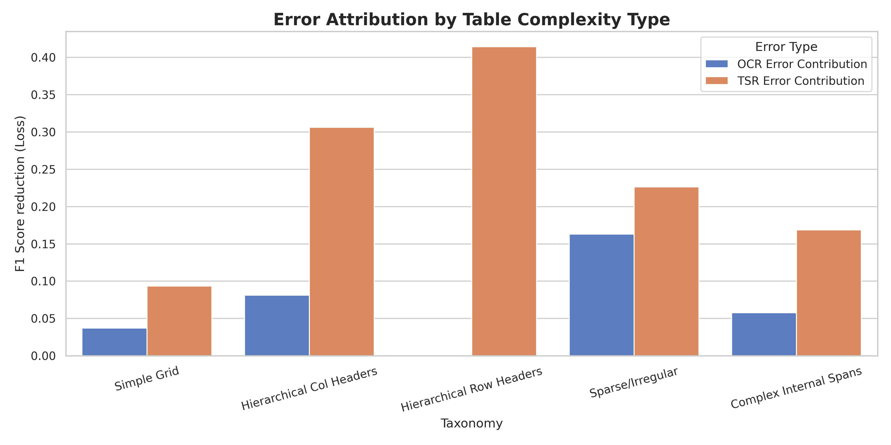

# SciTSR Table Structure Recognition Error Analysis

## 프로젝트 개요

이 프로젝트는 SciTSR 데이터셋을 사용하여 기존 OCR + TSR 파이프라인의 오류를 정밀하게 분석하기 위한 실험 프레임워크입니다. GNN 의존성을 제거하고, 규칙 기반 베이스라인(PaddleOCR)과 SOTA 모델(Table Transformer)을 통해 표 구조 복잡도에 따른 성능 한계를 측정합니다.

---

## 📊 표 구조 복잡도 유형별 상세 분석 (2026-02-02 업데이트)

표의 구조적 특성에 따라 5가지 복잡도 유형(Taxonomy)을 정의하고, **PaddleOCR(OCR) + Table Transformer(TSR)** 조합으로 실험을 수행했습니다.

### 1. 표 복잡도 유형 (Taxonomy)
| 유형 | 특징 | 대표 샘플 (SciTSR) |
| :--- | :--- | :--- |
| **Type 1: Simple Grid** | 규칙적인 격자 구조, 병합 없음 | `1003.0628v1.3` |
| **Type 2: Hierarchical Col** | 다중 행 컬럼 헤더 (가로 병합) | `1504.01806v1.4` |
| **Type 3: Hierarchical Row** | 트리 구조 로우 헤더 (세로 병합) | `1805.02036v1.2` |
| **Type 4: Sparse/Irregular** | 구분선 부재 또는 낮은 데이터 밀도 | `1704.01419v1.3` |
| **Type 5: Complex Spans** | 데이터 본문 내 복합 병합 셀 존재 | `1807.01801v1.6` |

### 2. 베이스라인 모델 (Baselines)
- **OCR Engine**: [PaddleOCR](https://github.com/PaddlePaddle/PaddleOCR) (v2.7+)
- **TSR Model**: [Table Transformer (TATR)](https://github.com/microsoft/table-transformer) (Structure Only 모드)
- **평가 라이브러리**: 자체 구현 `RelationEvaluator` (Adjacency Relation 기반)

---

### 3. 시각화 분석 결과

#### 🧪 유형별 에러 분포 히트맵
어떤 표 구조에서 어떤 종류의 에러가 발생하는지 상세히 보여줍니다.

- **Merge/Split**: 계층 구조(Type 2, 3)에서 셀 경계 오인으로 인해 빈번히 발생
- **Row/Col Shift**: 헤더 인식 실패 시 하위 데이터 전체가 밀리는 현상 (Type 3 최다)

#### 📉 에러 증상 (Shift vs Loss) 분석
구조적 어긋남(Shift)과 데이터 유실(Cell Loss) 지표를 비교 분석한 결과입니다.

- **Shift**는 계층형 표에서, **Loss**는 희소 표(Sparse)에서 주된 오류 증상으로 나타남

#### 🔬 시나리오별 성능 비교 (Error Attribution)
OCR 단계와 TSR 단계 중 어디가 병목인지 분석한 결과입니다.

- 대부분의 복잡한 표 구조에서 **TSR(구조 파악)** 단계의 오류 기여도가 **70% 이상**으로 압도적임

---

## 프로젝트 구조

```
/home/user/t1-7/
├── scripts/
│   ├── run_taxonomy_analysis.py    # 5대 유형별 실험 자동화
│   ├── generate_taxonomy_graphics.py # 결과 시각화 및 히트맵 생성
│   └── ...
├── src/
│   ├── ocr_tsr/
│   │   ├── enhanced_pipeline.py   # PaddleOCR + TATR 통합 파이프라인
│   │   └── table_transformer.py   # TATR 모델 래퍼
│   ├── evaluation/
│   │   └── relation_evaluator.py  # 인접 관계 기반 정밀 평가 로직
│   └── ...
├── results/
│   └── taxonomy_analysis/         # 실험 결과 데이터 및 시각화 파일
└── README.md
```

## 검증 방법론 (Relation Comparison)

단순한 좌표 매칭이 아닌 **논리적 인접 관계(Adjacency Relation)**를 대조합니다.
1. 모든 셀 쌍에 대해 수평/수직 이웃 관계를 추출
2. Ground Truth 세트와 모델 예측 세트 간의 교집합(TP), 차집합(FP/FN) 계산
3. 이를 통해 **Shift(밀림)**와 **Merge(병합)**를 수학적으로 구분하여 탐지

---

**Last Updated**: 2026-02-02  
**Status**: ✅ Taxonomy Analysis Complete | 📊 5-Type Error Attribution Finalized
