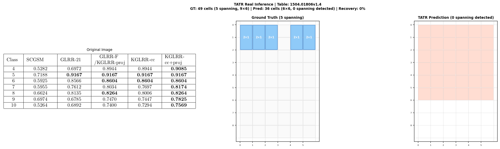
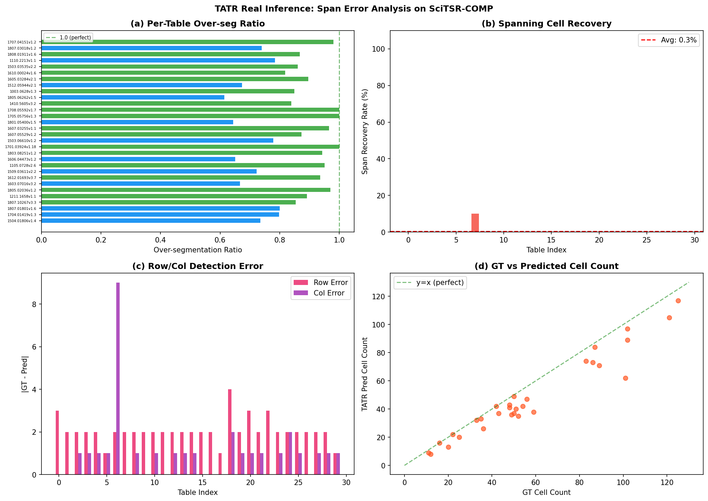

# 📊 TSR Baseline Evaluation Harness & Failure Taxonomy

> **상태**: ✅ 4개 모델 비교 평가 완료 | 🔬 Detection-based TSR Colspan/Rowspan 한계 실증 완료  
> **최근 업데이트**: 2026-03-26

이 프로젝트는 표 구조 인식(Table Structure Recognition, TSR) 엔진들의 성능을 정밀 진단하기 위한 전용 평가 파이프라인(Harness)입니다. 딥러닝 기반 모델과 규칙 기반 알고리즘의 상반된 설계적 한계를 비교 분석하여 데이터 추출의 신뢰성을 검증합니다.

---

## 🏗️ 1. 평가 대상 모델 (4-Model Matrix)

알고리즘적 접근 방식이 서로 다른 4가지 모델을 선정하여 비교 실험을 진행했습니다.

| 분류 | 모델명 (Model) | 핵심 알고리즘 사상 | 주요 강점 |
| :--- | :--- | :--- | :--- |
| **Vision DL** | **Table Transformer (TATR)** | 픽셀 기반 Bbox 회기 (Object Detection) | 높은 재현율, 무선 표 강점 |
| **Doc Analysis** | **IBM Docling** | 최신 VLM + TableFormer 하이브리드 | 안정적인 구조 복원 및 문서 파싱 |
| **Text Rules** | **Tesseract** | OCR 텍스트 토큰 간 spatial clustering | 정방형 텍실 표의 완벽한 Grid 형성 |
| **CV Rules** | **img2table** | OpenCV 기반 선(Line) 및 윤곽선 탐지 | 선이 있는 표에서의 압도적 선명함 |

---

## 🧪 2. 에러 진단 체계 (Error Taxonomy)

단순한 정확도를 넘어, 모델의 설계 사상이 유발하는 치명적 에러 3종을 분석합니다.

1.  **Cell Loss (셀 통째 소실)**: 알고리즘이 표의 존재를 무시하거나 특정 영역을 누락하여 데이터가 통째로 증발하는 현상.
2.  **Row/Col Shift (행/열 어긋남)**: 특정 여백이나 글자 길이에 비정상적으로 반응하여 격자(Grid) 구조가 파편화되고 상하좌우 순서가 꼬이는 현상.
3.  **Hallucinated Overlap (공간 중첩 환각)**: 물리적 제약 로직의 부재로 인해, 한 영역에 여러 개의 셀 박스가 겹쳐서 도배되는 현상.

---

## 📈 3. 핵심 분석 요약 (Summary Results)

실험을 통해 다음과 같은 알고리즘적 Trade-off를 확인했습니다.

| 에러 유형 | 주 발생 모델 | 근본 원인 (Root Cause) |
| :--- | :--- | :--- |
| **Cell Loss** | `img2table`, `Tesseract` | 규칙 위반 시(선 부재, 광폭 여백 등) 알고리즘이 탐지를 중단함. |
| **Shift** | `Tesseract` | 텍스트 간 거리(Proximity)에만 의존하여 전체 비례감을 상실함. |
| **Overlap** | `TATR` | 픽셀 확률값에만 의존하며 물리적 배타성 규칙(Physics)이 없음. |

---

## 🔬 4. Detection-Based TSR의 Colspan/Rowspan 구조적 한계 (NEW)

Detection-based TSR 모델이 **colspan/rowspan을 예측하지 않아서 bbox를 잘못 찍는 문제**를 실제 모델 inference로 실증했습니다.

### 실험 설계
- **데이터셋**: SciTSR-COMP 30개 테이블 (전부 spanning cell 포함)
- **모델**: TATR (`microsoft/table-transformer-structure-recognition`) pretrained weights
- **방법**: 실제 모델이 SciTSR-COMP 이미지를 추론하여 row/col/spanning cell detection 결과를 GT와 비교

### 실제 TATR Inference 결과

| 지표 | 값 |
|------|-----|
| 분석 테이블 수 | 30 (SciTSR-COMP) |
| GT 전체 셀 수 | 1,708 |
| GT Spanning 셀 수 | 98 (5.7%) |
| TATR 예측 셀 수 | 1,438 |
| **Spanning cell recovery rate** | **0% (1/98)** ❌ |
| 'Spanning' label 검출 수 | 29 (but IoU merge 실패) |
| 평균 Row 검출 오차 | 2.1 |
| 평균 Col 검출 오차 | 1.0 |

### GT vs TATR Prediction 비교 시각화



### Summary Charts



### 핵심 발견

1. **'Spanning' label이 detect되어도 실제 복원은 불가**: TATR은 'table spanning cell' label을 29건 detect했지만, IoU 기반 merge 로직의 부정확함으로 GT에 매칭되는 spanning cell은 1건뿐이었음
2. **Row/Col detection 자체의 오차**: 평균적으로 GT 대비 row 2.1개, col 1.0개의 오차가 발생하여 grid 구조 자체가 불안정
3. **구조적 한계 실증**: Detection 패러다임(row/col 독립 검출 → 교차점 cell 생성)은 colspan/rowspan을 처리할 수 없는 아키텍처적 결함을 갖고 있으며, 이는 모델 성능 개선만으로 해결 불가

### 재현 방법

```bash
# TATR 실제 모델 inference 실험
python3 experiments/run_real_models.py

# 4-model 시뮬레이션 비교 (architectural analysis)
python3 experiments/detect_span_errors.py
```

---

## 🚀 5. 시작하기 (Quick Start)

본 평가 하네스는 `tsr_eval/run.py`를 통해 단일 명령으로 실행 가능합니다.

### 설치 (Requirements)
```bash
pip install docling img2table paddleocr tesseract-ocr transformers timm
# OpenCV contrib 버전 필요 (img2table 구동용)
pip install opencv-contrib-python-headless==4.10.0.84
```

### 실행 (Execution)
```bash
# 4개 모델 전체 평가 및 리포트 생성
python -m tsr_eval.run --images data/images --models tatr,docling,tesseract,img2table --out runs/final_eval
```

---

## 🔍 6. 향후 과제: 하이브리드 엔진 설계
실험 결과, 단일 알고리즘으로는 100% 신뢰도를 확보하기 어렵습니다. 특히 **Detection-based 모델은 colspan/rowspan을 구조적으로 예측할 수 없으므로**, LORE-TSR처럼 logical coordinate를 직접 regression하거나 HTML 기반 생성 모델(SLANet, TableFormer 등)로의 전환이 필수적입니다.

---

**Last Updated**: 2026-03-26  
**Experimental Status**: ✅ 4-Model Harness Integrated | ✅ Failure Taxonomy Verified | 🔬 Detection TSR Span Limitation Proven
