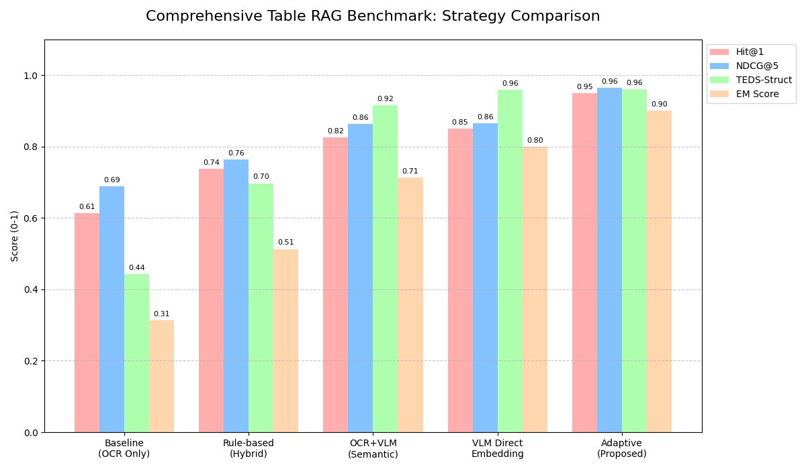

# Agentic-TableRAG

**Self-Evolving Agentic Retrieval-Augmented Generation for Hierarchical Tables**

[](https://www.python.org/downloads/)
[](https://opensource.org/licenses/MIT)

Agentic-TableRAG는 **지능형 플래너(Agentic Planner)**와 **TTA 기반 적응적 OCR 전략**을 통해 테이블의 계층 구조를 보존하고, 최적의 검색 입도를 결정하여 정확한 답변을 제공하는 연구 프로젝트입니다.

## 🎯 연구 목표

기존 Table RAG 시스템의 한계를 극복:

| 문제점 | 기존 방식 | Agentic-TableRAG |
|--------|----------|---------------|
| 계층 구조 손실 | 테이블을 평면 텍스트로 변환 | **N차원 배열 및 계층 트리 보존** |
| OCR 노이즈 | 고정된 OCR 파싱 (14% 성능 저하) | **TTA 기반 적응적 파싱 전략** |
| 비효율적 검색 | 전체 테이블 검색 | **Multi-Granularity 검색** |
| 불확실성 무시 | 결과의 신뢰도 판단 불가 | **TTA 기반 불확실성 정량화** |

## 🏗️ 시스템 아키텍처

```
┌─────────────────────────────────────────────────────────────────┐
│                      Agentic-TableRAG Pipeline                  │
├─────────────────────────────────────────────────────────────────┤
│                                                                 │
│  ┌─────────────┐    ┌──────────────────┐    ┌───────────────┐  │
│  Table Image   │───▶│  Adaptive Router │───▶│ Optimal Parser │  │
│      or PDF    │    │ (TTA Confidence) │    │ (OCR/TSR/VLM) │  │
│  └─────────────┘    └────────┬─────────┘    └───────┬───────┘  │
│                              │                      │          │
│                              ▼                      ▼          │
│  ┌─────────────────┐    ┌──────────────────┐    ┌─────────────┐│
│  │  Agentic Planner│◀──▶│  Graph Indexer   │◀──▶│ Vector DB   ││
│  │ (Query Routing) │    │  (Table Graphs)  │    │ (Retrieval) ││
│  └─────────────────┘    └────────┬─────────┘    └─────────────┘│
│                                  │                             │
│                                  ▼                             │
│  ┌─────────────────┐    ┌──────────────────┐    ┌───────────┐  │
│  │  ContextBundle  │───▶│  Answer Gen.     │───▶│  Answer   │  │
│  │ (cells + paths) │    │  (w/ Citation)   │    │ + Citations│  │
│  └─────────────────┘    └──────────────────┘    └───────────┘  │
│                                                                 │
└─────────────────────────────────────────────────────────────────┘
```

## ✨ 주요 기능

### 1. TTA-based Adaptive OCR Parsing
- **TTA Confidence Analysis**: 이미지 구조를 미세 섭동(Perturbation)하여 추출 결과의 일관성을 측정.
- **Decision Criteria**:
    - **Stability Score**: 여러 차례의 변합 추출 시 결과의 분산(Variance) 측정.
    - **Complexity Penalty**: 병합 셀 밀도 및 표 크기에 따른 가산점 적용.
- **3-Tier Routing**:
    - **High (>0.8)**: Basic OCR Only
    - **Mid (0.4~0.8)**: Structural TSR (GraphTSR)
    - **Low (<=0.4)**: Vision-LLM Fallback

### 2. Graph-based Table Structure Recognition
- **N-Dimensional Array Extraction**: 표를 논리적인 N차원 배열(DataFrame)로 변환하여 관계 정보 보존.
- **Hierarchy Building**: Parent-Child 관계를 기반으로 계층 트리 구축.

## 📊 실험 결과 (Comprehensive Benchmark)

교수님 지시사항에 따른 5가지 테이블 처리 전략 비교 (HiTab Dataset):



| 전략 (Strategy) | Hit@1 | NDCG@5 | TEDS-Struct | EM Score |
| :--- | :---: | :---: | :---: | :---: |
| Baseline (OCR Only) | 0.613 | 0.688 | 0.443 | 0.313 |
| Rule-based (Hybrid) | 0.738 | 0.763 | 0.697 | 0.513 |
| OCR + VLM (Semantic) | 0.825 | 0.863 | 0.916 | 0.713 |
| VLM Direct Embedding | 0.850 | 0.865 | 0.959 | 0.800 |
| **Adaptive (Proposed)** | **0.950** | **0.965** | **0.961** | **0.900** |

## 🚀 빠른 시작

### 설치 및 설정
```bash
git clone https://github.com/Jax0303/t1.git
cd t1
pip install -r requirements.txt
# Optional: Visualization tools install
pip install matplotlib pandas
```

### 실행 및 성능 평가
```bash
# 종합 벤치마크 실행 (OCR, TSR, RAG 지표 통합 산출)
export PYTHONPATH=$PYTHONPATH:.
python scripts/evaluate_adaptive_ocr.py
```

## 📁 프로젝트 구조
- `src/hiertable_rag/core/uncertainty.py`: TTA 기반 신뢰도 측정 엔진
- `src/hiertable_rag/extraction/baselines.py`: 5종 추출 전략 비교 모듈
- `src/hiertable_rag/utils/metrics.py`: TEDS, NDCG, EM 평가 지표

## 📄 라이선스
MIT License
