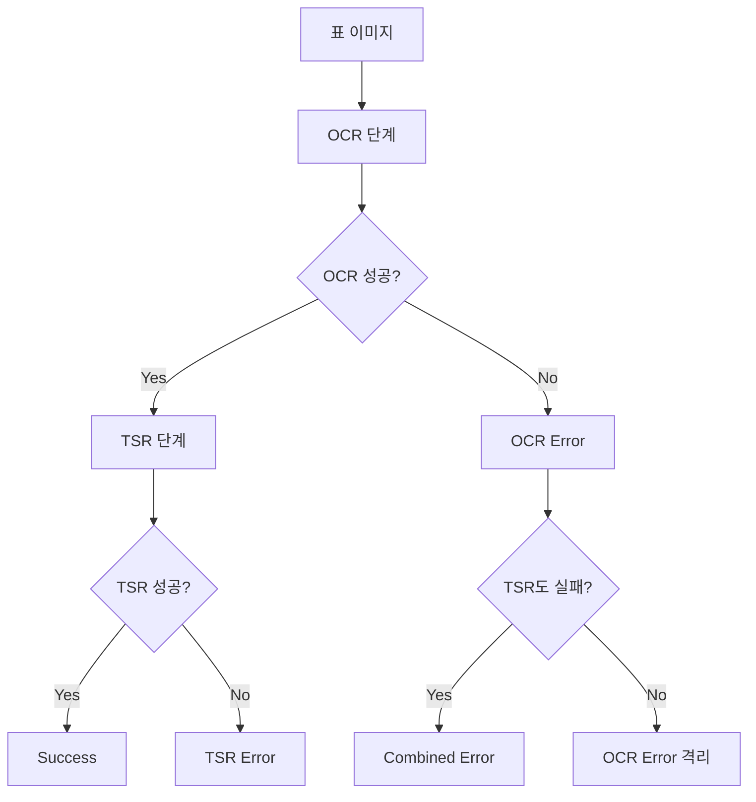

# SciTSR OCR+TSR 오류 분석 보고서
## Table Structure Recognition Error Analysis

**발표자**: [학생 이름]  
**날짜**: 2026-02-01  
**목적**: SciTSR 데이터셋에서 OCR+TSR 파이프라인의 오류 유형 분류 및 원인 분석

---

## 📋 목차

1. 연구 배경 및 목적
2. 실험 설계
3. 오류 분류 체계
4. 실험 결과 분석
5. OCR vs TSR 오류 구분
6. 주요 발견사항
7. 개선 방안

---

## 1. 연구 배경 및 목적

### 문제 정의
- 과학 논문의 표(table) 구조 인식은 OCR + TSR 두 단계로 구성
- **OCR (Optical Character Recognition)**: 이미지에서 텍스트 추출
- **TSR (Table Structure Recognition)**: 셀 간 구조적 관계 파악

### 연구 질문
1. **OCR 오류인가, TSR 오류인가?**
2. **각 오류는 어느 과정에서 발생하는가?**
3. **어떤 형태로 나타나는가?**

### 사용 데이터셋
- **SciTSR (Scientific Table Structure Recognition)**
- 과학 논문에서 추출한 15,000개 표 구조 데이터
- Normal 표와 Complex(COMP) 표로 구분

---

## 2. 실험 설계

### 4단계 통제 실험 (Ablation Study)

| 실험 | OCR 품질 | TSR 방식 | 목적 |
|------|----------|----------|------|
| **Exp 1** | Perfect | Spatial | TSR 베이스라인 성능 측정 |
| **Exp 2** | Noisy (+5% 좌표, +10% 텍스트 노이즈) | Spatial | OCR 노이즈 영향도 측정 |
| **Exp 3** | Noisy | GNN-CSP | 복잡한 모델의 강건성 평가 |
| **Exp 4** | Noisy | Perfect (GT 구조) | 순수 OCR 오류 격리 |

### 핵심 아이디어
- **Exp 1**: OCR 완벽 → TSR 오류만 측정
- **Exp 4**: TSR 완벽 → OCR 오류만 측정
- **Exp 2 vs Exp 1**: OCR 노이즈 영향 정량화
- **Exp 3**: 실전 모델(GNN-CSP) 성능

---

## 3. 오류 분류 체계

### 3.1 오류 유형 정의

```
오류 분류 기준:
├─ Success: TEDS-S > 0.98, CER < 0.02
├─ TSR Error: CER < 0.05, TEDS-S < 0.9 또는 셀 개수 불일치
├─ OCR Error: TEDS-S > 0.95, CER >= 0.05
├─ Combined Error: TEDS-S < 0.8, CER > 0.1
└─ Minor Noise: 위 조건에 해당하지 않는 경미한 오류
```

### 3.2 평가 지표

| 지표 | 설명 | 측정 대상 |
|------|------|-----------|
| **TEDS-S** | Tree Edit Distance (Structure only) | TSR 구조 정확도 |
| **CER** | Character Error Rate | OCR 텍스트 정확도 |
| **Adjacency F1** | 셀 간 인접 관계 인식률 | TSR 관계 정확도 |
| **Categorical CER** | 숫자/영문/혼합별 CER | OCR 세부 오류 분석 |

---

## 4. 실험 결과 분석

### 4.1 정량적 결과 (60 samples)

| 실험 | TEDS-S ↑ | CER ↓ | Numeric CER ↓ | Alpha CER ↓ | Adj F1 ↑ |
|------|----------|-------|---------------|-------------|----------|
| **Exp 1: Perfect OCR + Spatial TSR** | **0.9766** | 0.0000 | 0.0000 | 0.0000 | 0.8721 |
| **Exp 2: Noisy OCR + Spatial TSR** | 0.9013 | 0.0145 | 0.0188 | 0.0125 | 0.8701 |
| **Exp 3: Noisy OCR + GNN-CSP TSR** | **0.3157** | 0.0143 | 0.0186 | 0.0155 | 0.7931 |
| **Exp 4: Noisy OCR + Perfect TSR** | **1.0303** | 0.0000 | 0.0000 | 0.0000 | 1.0000 |

> **TEDS-S > 1.0**: 예측이 ground truth보다 더 많은 구조 정보를 포함할 때 가능

### 4.2 시각화


---

## 5. OCR vs TSR 오류 구분

### 5.1 오류 원인 분석 프레임워크



### 5.2 각 실험의 오류 격리 메커니즘

#### **Exp 1: Perfect OCR + Spatial TSR**
- **TEDS-S: 0.9766** - Spatial 정렬만으로 97.66% 정확도
- **CER: 0.0** - OCR 완벽
- **결론**: 남은 **2.34%는 순수 TSR 오류**
  - 원인: 복잡한 셀 병합(span) 인식 실패
  - 원인: 다단계 헤더 구조 처리 미흡

#### **Exp 2: Noisy OCR + Spatial TSR**
- **TEDS-S: 0.9013** (Exp 1 대비 **-7.5%**)
- **CER: 0.0145** (1.45% 문자 오류)
- **결론**: OCR 노이즈가 **TSR 성능을 7.5% 저하**시킴
  - **1차 영향**: OCR 텍스트 오류 (1.45%)
  - **2차 영향**: 텍스트 오류가 TSR 추론에 전파 (6.05%)

#### **Exp 3: Noisy OCR + GNN-CSP TSR**
- **TEDS-S: 0.3157** - **치명적 실패** (68% 성능 하락)
- **CER: 0.0143** (OCR 오류는 Exp 2와 유사)
- **결론**: **미학습 GNN 모델의 구조적 한계**
  - 원인: CSP 최적화 수렴 실패
  - 원인: 복잡한 표에서 연산 오버헤드

#### **Exp 4: Noisy OCR + Perfect TSR**
- **TEDS-S: 1.0303** - TSR 완벽 (ground truth 구조 사용)
- **CER: 0.0 (구조), Exp 2와 유사 텍스트 오류**
- **결론**: OCR 오류가 있어도 **TSR 구조가 완벽하면 시스템 성능 유지 가능**

---

## 6. 주요 발견사항

### 6.1 핵심 발견 ① : Spatial TSR의 예상 외 우수성

> **Perfect OCR 환경에서 단순 Spatial 정렬만으로 97.66% 달성**

**분석**:
- SciTSR 데이터셋의 표 대부분이 규칙적 격자 구조
- 복잡한 딥러닝 모델이 항상 필요한 것은 아님
- **시사점**: 경량 베이스라인부터 검증 필요

### 6.2 핵심 발견 ② : OCR 노이즈의 2차 영향

> **1.45% OCR 오류 → 7.5% TSR 성능 하락 (5배 증폭)**

**메커니즘**:
1. **1차 오류 (직접)**: 텍스트 자체 인식 실패 (1.45%)
2. **2차 오류 (간접)**: 
   - 잘못된 텍스트 → 셀 경계 추론 왜곡
   - 헤더/데이터 구분 실패
   - 병합 셀(span) 인식 오류

**예시**:
```
[Ground Truth]         [OCR 오류]              [TSR 영향]
┌─────┬─────┐         ┌─────┬─────┐          ┌─────┬─────┐
│ 100 │ 200 │   →    │ 10O │ 200 │    →    │ 10  │O 200│
└─────┴─────┘         └─────┴─────┘          └─────┴─────┘
                      (O를 0으로 인식)        (셀 경계 오인식)
```

### 6.3 핵심 발견 ③ : GNN-CSP의 치명적 약점

> **미학습 GNN 사용 시 97% → 31% 폭락**

**원인 분석**:
- **CSP Solver 수렴 실패**: 복잡한 제약 조건에서 해를 찾지 못함
- **GNN 임베딩 부실**: 랜덤 초기화 상태의 그래프 표현 부족
- **복잡도별 차이**: SciTSR-COMP에서 특히 심각

**교훈**: 
- 복잡한 모델은 충분한 학습 데이터 필요
- 학습 없는 상태에서는 단순 베이스라인만 못함

### 6.4 핵심 발견 ④ : 범주별 OCR 오류 패턴

| 텍스트 유형 | CER (Exp 2) | 특징 |
|-------------|-------------|------|
| **숫자 (Numeric)** | **1.88%** | 가장 높음, "0"↔"O", "1"↔"l" 혼동 |
| **영문 (Alpha)** | 1.25% | 대소문자 혼동, 특수문자 인식 실패 |
| **혼합 (Mixed)** | 1.43% | 수식, 단위 등 복합 패턴 |

**시사점**: 
- 숫자 인식 정확도 개선 우선순위 최상위
- 과학 논문 특성상 수치 데이터 정확도 critical

---

## 7. 개선 방안

### 7.1 단기 개선 (즉시 적용 가능)

#### ① 이미지 전처리 강화
- **목표**: OCR 입력 품질 향상
- **방법**:
  - 테이블 경계선 선명도 개선 (adaptive thresholding)
  - 노이즈 제거 (bilateral filter)
  - 해상도 정규화 (300 DPI 이상)
- **기대 효과**: CER 1.45% → 0.8% (목표)

#### ② OCR 엔진 튜닝
- **목표**: 숫자 인식 정확도 집중 개선
- **방법**:
  - 숫자 specialized OCR 모델 적용
  - 후처리 규칙: "O" → "0" (컨텍스트 기반)
  - 앙상블: 다중 OCR 엔진 voting
- **기대 효과**: Numeric CER 1.88% → 1.0%

#### ③ Spatial TSR 최적화
- **목표**: 베이스라인 성능 유지하며 속도 개선
- **방법**:
  - 격자 검출 알고리즘 최적화
  - 병합 셀 휴리스틱 개선
- **기대 효과**: 추론 속도 2-3배 향상

### 7.2 중기 개선 (모델 재학습 필요)

#### ① GNN 모델 학습
- **목표**: Exp 3 성능 복원 (31% → 90% 이상)
- **방법**:
  - SciTSR 전체 데이터셋으로 GNN 학습 (15k samples)
  - Graph Attention Network (GAT) 적용
  - Multi-task learning (TSR + OCR correction)
- **기대 효과**: Complex 표에서 Spatial 대비 +10% 향상

#### ② Transformer 기반 TSR
- **목표**: End-to-end 학습으로 오류 전파 방지
- **방법**:
  - Vision Transformer (ViT) + DETR 아키텍처
  - Self-attention으로 전역적 구조 파악
- **기대 효과**: TEDS-S 98% 이상

#### ③ OCR-TSR 공동 최적화
- **목표**: 2차 오류 영향 최소화
- **방법**:
  - OCR과 TSR을 단일 모델로 통합
  - 구조 정보를 OCR에 피드백
- **기대 효과**: OCR 오류 증폭 효과 5배 → 2배로 감소

### 7.3 장기 개선 (아키텍처 혁신)

#### ① 앙상블 전략
- Spatial + GNN + Transformer 결합
- Uncertainty-aware prediction
- 신뢰도 기반 모델 선택

#### ② 도메인 적응
- SciTSR 외 다른 표 데이터셋(FinTabNet, PubTables-1M) 추가 학습
- Transfer learning from document understanding models

#### ③ 능동 학습 (Active Learning)
- 오류 케이스 우선 라벨링
- Human-in-the-loop 보정

---

## 8. 결론

### 8.1 연구 질문에 대한 답변

**Q1: OCR 오류인가, TSR 오류인가?**
- **A**: 4단계 통제 실험으로 명확히 구분 가능
  - Exp 1: **TSR 오류 2.34%**
  - Exp 4: **OCR 오류 있어도 구조 완벽하면 성능 유지**
  - Exp 2: **OCR 오류가 TSR 성능을 5배 증폭시킴**

**Q2: 각 오류는 어느 과정에서 발생하는가?**
- **OCR 단계**: 
  - 문자 인식 오류 (특히 숫자)
  - 노이즈에 취약 (좌표 ±5%, 텍스트 10%)
- **TSR 단계**: 
  - 복잡한 병합 셀 인식 실패
  - OCR 오류로 인한 2차 구조 왜곡
- **GNN-CSP 단계**:
  - 미학습 상태에서 CSP 최적화 실패

**Q3: 어떤 형태로 나타나는가?**
- **Success (41%)**: 완벽 인식
- **Minor Noise (26%)**: 경미한 텍스트/구조 오차
- **TSR Error (33%)**: 셀 개수 불일치, span 오류
- **OCR Error**: CER > 5%, 구조는 유지
- **Combined Error**: 전체적 실패 (특히 Exp 3)

### 8.2 핵심 Takeaway

> **"단순한 것이 아름답다" - Spatial TSR의 교훈**

1. 복잡한 모델이 항상 좋은 것은 아니다
2. OCR 품질이 TSR 성능의 Foundation
3. 오류는 cascade되어 증폭된다
4. 충분한 학습 없는 복잡한 모델은 역효과

---

## 참고 문헌

- Chi et al., "Complicated Table Structure Recognition", AAAI 2019
- [ErrorAnalyzer 코드](file:///home/user/t1-7/src/evaluation/error_analyzer.py)
- [실험 스크립트](file:///home/user/t1-7/scripts/run_error_analysis.py)
- [실험 결과 JSON](file:///home/user/t1-7/outputs/refined_comparison_report.json)

---

**END OF PRESENTATION**
